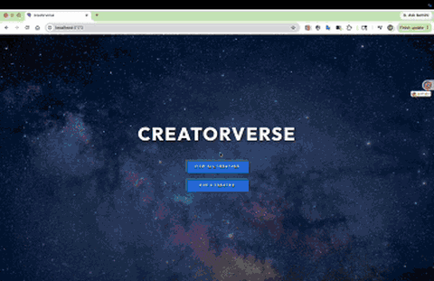

# WEB103 Prework - *Creatorverse*

Submitted by: **Ke Zhang**

About this web app: **Creatorverse is a React app that lets users browse, add, edit, and delete their favorite content creators (YouTube, Twitch, TikTok, etc.). Creator data is stored in a Supabase `creators` table with fields for name, channel URL, description, and an optional image URL.**

Time spent: **48** hours

## Required Features

The following **required** functionality is completed:

<!-- 👉🏿👉🏿👉🏿 Make sure to check off completed functionality below -->
- [x] **A logical component structure in React is used to create the frontend of the app**
- [x] **At least five content creators are displayed on the homepage of the app**
- [x] **Each content creator item includes their name, a link to their channel/page, and a short description of their content**
- [x] **API calls use the async/await design pattern via Axios or fetch()**
- [x] **Clicking on a content creator item takes the user to their details page, which includes their name, url, and description**
- [x] **Each content creator has their own unique URL**
- [x] **The user can edit a content creator to change their name, url, or description**
- [x] **The user can delete a content creator**
- [x] **The user can add a new content creator by entering a name, url, or description and then it is displayed on the homepage**

The following **optional** features are implemented:

- [x] Picocss is used to style HTML elements
- [x] The content creator items are displayed in a creative format, like cards instead of a list
- [x] An image of each content creator is shown on their content creator card

The following **additional** features are implemented:

* [x] Full-screen landing page (hero background, links to creator list and add form)
* [x] Supabase credentials loaded from `.env.local` (Vite environment variables)
* [x] Optional `imageURL` field on add/edit forms and detail pages
* [x] Homepage hints when data fails to load (e.g., Row Level Security misconfiguration)
* [x] Card grid layout with custom CSS (light/dark-friendly)

## Video Walkthrough

Here's a walkthrough of implemented required features:

## Notes

Describe any challenges encountered while building the app or any additional context you'd like to add.

- The creator grid with five entries lives at **`/creators`** (open “VIEW ALL CREATORS” from the landing page at **`/`**).
- Data did not appear on the homepage until **Row Level Security** was disabled on the `creators` table (per prework instructions) and `.env.local` was pointed at the correct Supabase project.
- `imageURL` values must be **direct image links** (e.g. `.jpg`, `.png`, or image CDN URLs), not channel homepages, for images to render in `` tags.

## License

Copyright [2026] [Ke Zhang]

Licensed under the Apache License, Version 2.0 (the "License"); you may not use this file except in compliance with the License. You may obtain a copy of the License at

> http://www.apache.org/licenses/LICENSE-2.0

Unless required by applicable law or agreed to in writing, software distributed under the License is distributed on an "AS IS" BASIS, WITHOUT WARRANTIES OR CONDITIONS OF ANY KIND, either express or implied. See the License for the specific language governing permissions and limitations under the License.
